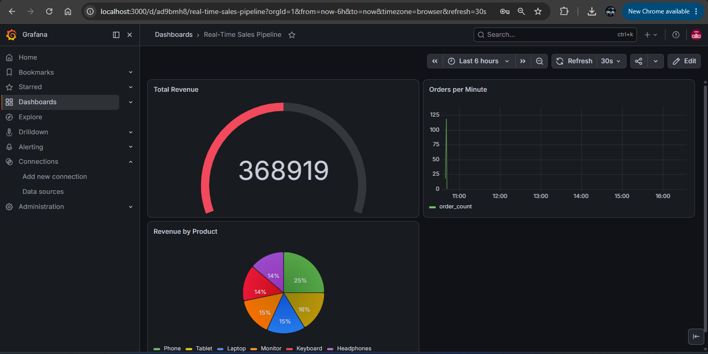

# Real-Time Sales Pipeline

A real-time data engineering pipeline that streams synthetic sales orders from a Kafka producer through PySpark Structured Streaming into TimescaleDB, visualized live in Grafana.



## Architecture

Faker (Python) → Kafka Producer → Kafka Topic: orders
                                        ↓
                               PySpark Structured Streaming
                                        ↓
                               TimescaleDB (PostgreSQL)
                                        ↓
                                     Grafana

## Tech Stack

- **Apache Kafka + Zookeeper** — message broker for real-time order streaming
- **Python + Faker** — synthetic order data generator (2 orders/sec)
- **PySpark Structured Streaming** — consumes Kafka topic, parses JSON, writes to DB
- **TimescaleDB** — time-series PostgreSQL for storing order events
- **Grafana** — live dashboard with 30s auto-refresh

## Dashboard Panels

- **Total Revenue** — gauge showing cumulative revenue across all orders
- **Orders per Minute** — time series of order volume over time
- **Revenue by Product** — pie chart breakdown across 6 product categories

## Run Locally

**Prerequisites:** Docker, Python 3.x, Java 17

```bash
# Start all services
docker-compose up -d

# Initialize database
docker exec -i timescaledb psql -U admin -d sales_db < db/init.sql

# Start producer (terminal 1)
cd producer && pip install -r requirements.txt && python producer.py

# Start consumer (terminal 2)
cd consumer && pip install -r requirements.txt && python consumer.py
```

Open Grafana at **http://localhost:3000** (admin/admin)

## Key Engineering Decisions

**Why Kafka over direct insert?**
Decouples the producer from the consumer. If the DB goes down, messages are retained in Kafka and replayed when it recovers. Direct insert loses data on failure.

**Why TimescaleDB over plain PostgreSQL?**
Hypertables partition data automatically by time, making time-range queries orders of magnitude faster at scale. The `time_bucket()` function enables native downsampling without application-level aggregation.

**Why PySpark over Faust or Kafka Streams?**
PySpark handles aggregations and windowed operations natively in the streaming API. For a pipeline that needs revenue aggregations per minute/product, Spark's micro-batch model gives cleaner code than manual state management in Faust.
